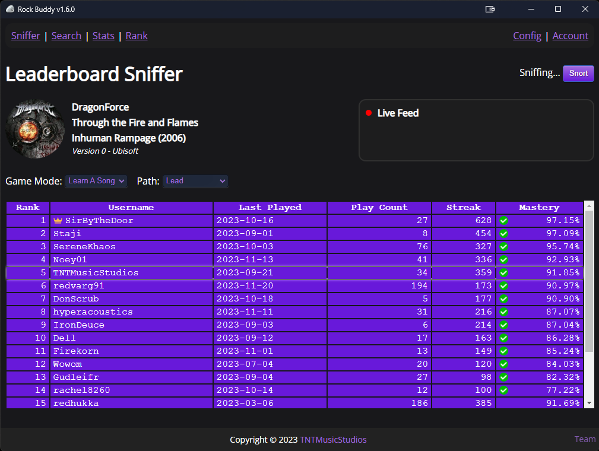

<!-- PROJECT LOGO -->

  <a href="https://github.com/tnt-coders/rock-buddy-app/releases">Download</a>
  ·
  <a href="https://github.com/tnt-coders/rock-buddy-app/issues">Bug Report</a>
  ·
  <a href="https://github.com/tnt-coders/rock-buddy-app/issues">Feature Request</a>
   
  
  <h1>Rock Buddy</h1>

  <b>Are you ready to get to the top of the leaderboard?</b>

<!-- ABOUT THE PROJECT -->
## About The Project

<b>What is Rock Buddy?</b> 
Rock Buddy is a tool that provides leaderboards for Rocksmith, including custom charts!
  

<b>How do I install Rock Buddy?</b> 
The latest version can be found in the <a href="https://github.com/tnt-coders/rock-buddy-app/releases" target="_blank">new-releases</a> section in github. Simply download and run the provided ".exe".
  

<b>What prerequisites are needed?</b> 
Rock Buddy requires RSMods v1.2.7.3 or later to properly verify scores. This is because RMods includes some code that prevents users from cheating. RSMods can be found <a href="https://github.com/Lovrom8/RSMods/releases">here</a>.
  

<b>How do I create an account?</b> 
To create an account, click the "Sign Up" button on the login page in the application and enter your account info. Once the account is created, log in and follow the steps on screen to verify your email address.
  

<b>How do I setup the app?</b> 
The first time you run Rock Buddy, you will need to go to the "Config" section and tell  it which Steam account you are using, as well as which Rocksmith profile it should import data from.
  
The "Sniffer" page will follow Rocksniffer and display leaderboards for whatever song you are currently on in-game.
  

(<a href="#readme-top">back to top</a>)

## Streaming Support

<b>How do I setup Rock Buddy as a browser source in OBS Studio?</b> 
Note: Adding Rock Buddy as an "application capture" will not work properly in OBS because it will not update while Rock Buddy is minimized.
  
To do it properly, add the "capture.html" file found in the "addons" folder as a browser source in OBS. This will allow Rock Buddy to properly update in OBS even when the app is minimized. The addons folder can be opened from within the app by clicking "Open Addons Folder" from the config page.
  

<b>How do I setup Rock Buddy as a browser source in OBS Studio for a multi PC setup?</b> 
On your gaming PC (the one that runs Rocksmith): Start Rock Buddy and go to the "config" section. Set the "host" in the addons section to the IP address of your gaming PC. Note that you must use the actual IP. "localhost" will not work.
  
On your streaming PC (the one that runs OBS): include the "capture.html" file found in the "addons" folder as a browser source. The addons folder can be opened from within the app by clicking "Open Addons Folder" from the config page. Additionally, open the "config.js" file and change the "addonsHost" to point the the IP address of your gaming PC. This must match the IP you specified in the Rock Buddy config window. If you changed the port in the Rock Buddy config window you must also change that here to match as well.
  

(<a href="#readme-top">back to top</a>)

## Website

For information, visit the <a href="https://rock-buddy.com/" target="_blank">rock-buddy.com</a>.

(<a href="#readme-top">back to top</a>)

<!-- CONTACT -->
## Contact

TNTMusicStudios - tntmusicstudios2018@gmail.com

(<a href="#readme-top">back to top</a>)

